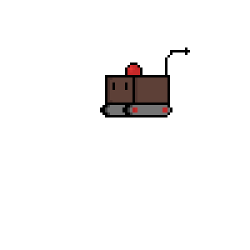

### Hi there 👋<h2> I'm Santiago</h2>

<h3>:guardsman:💻 About Me </h3>

- 🤔 &nbsp; Exploring new microcontrollers and tecnologies.

- 🎓 &nbsp; Electronic engineering at Universidad del Valle.

- 🌱 &nbsp; Learning about blockchain, machine learning and API desigin.

- ✍️ &nbsp; Making new devices as a hobby.

<h3>🛠 Tech Stack</h3>

- 💻 &nbsp; Python | C | C++ | VHDL | Java | Angular

<h3>🛠 To Learn</h3>

- :telescope: &nbsp; Machine Learning

